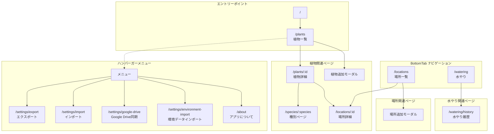
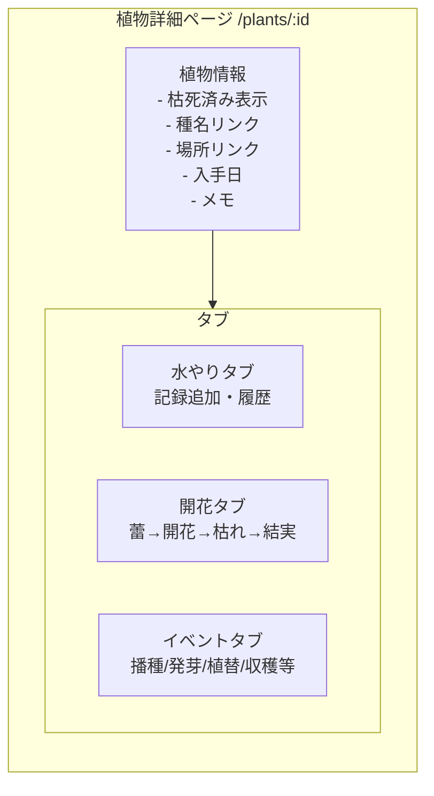
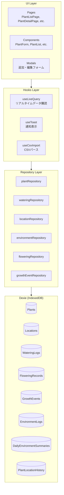
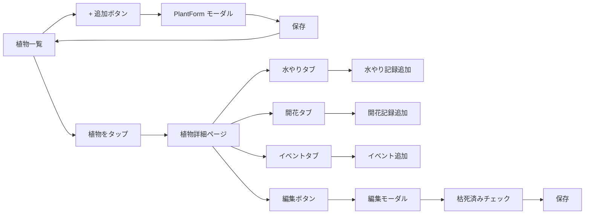
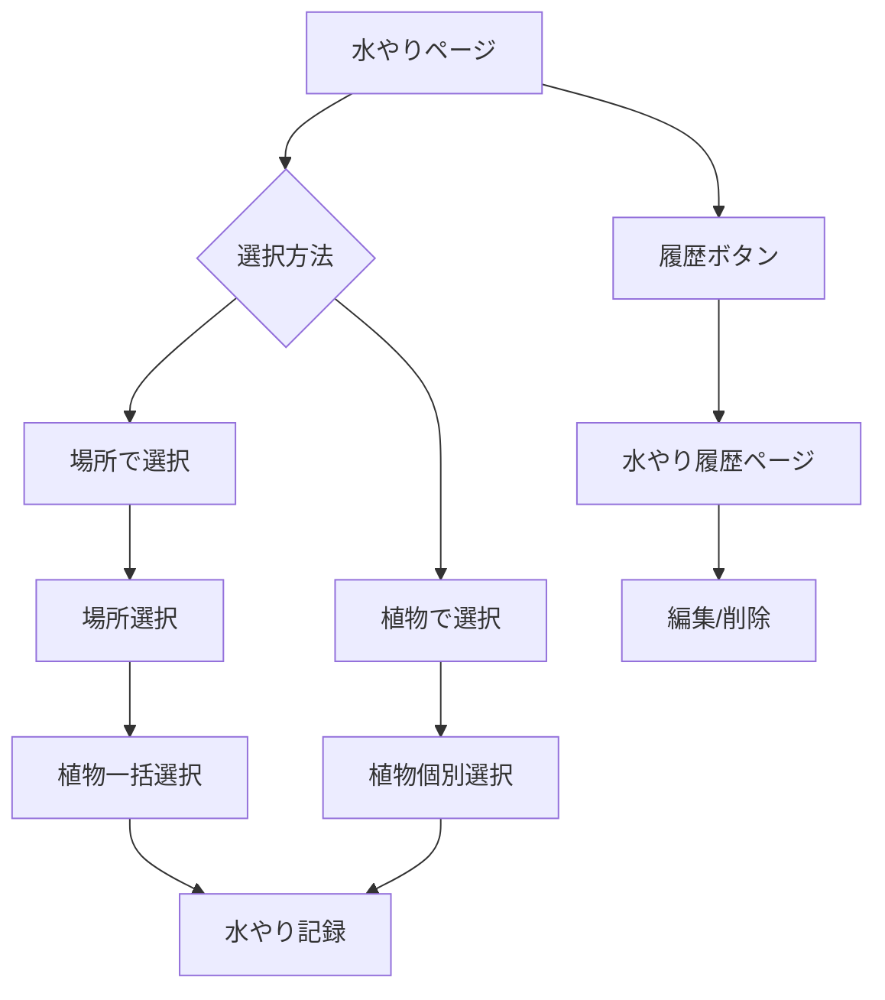
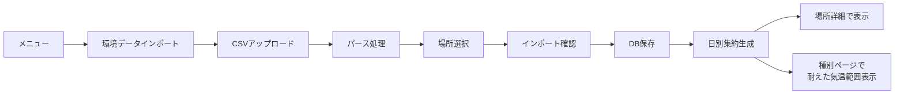
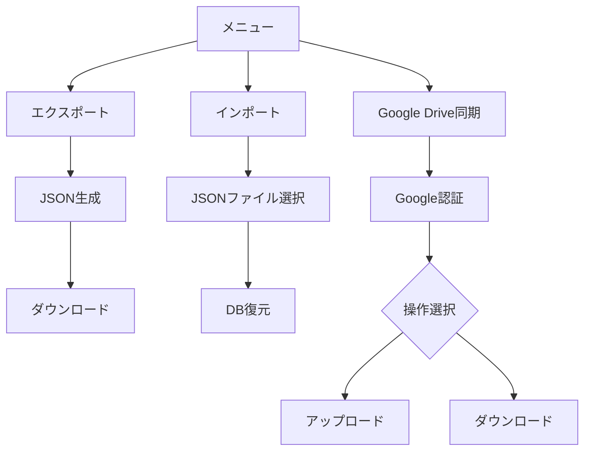
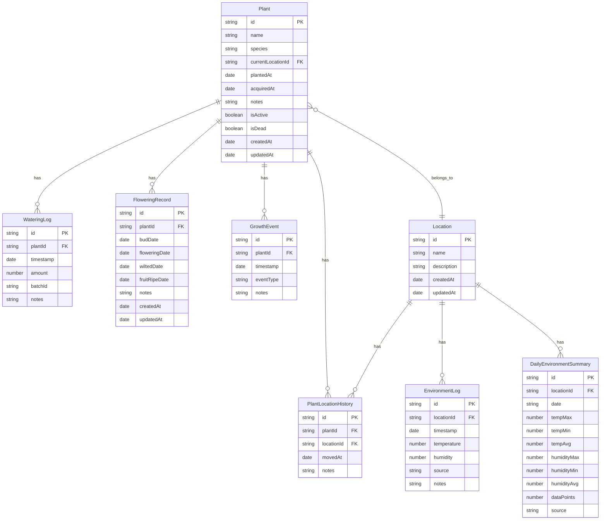
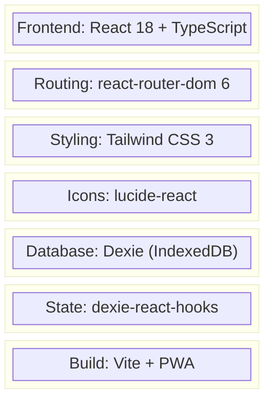

# plalog アプリケーション フロー図

## 概要

plalogは植物管理アプリケーションです。植物の水やり、開花記録、成長イベント、環境データを管理できます。

## ページ遷移フロー



## 植物詳細ページ タブ構造



## データフロー



## ユーザーフロー

### 植物管理フロー



### 水やりフロー



### 環境データフロー



### データ同期フロー



## エンティティ関連図



## 技術スタック



## ディレクトリ構造

```
src/
├── components/           # 共有コンポーネント
│   ├── layout/          # Header, BottomTab, PageLayout
│   ├── common/          # FAB, EmptyState, ListItem, Toast
│   └── ui/              # Button, Input, Modal, Select
│
├── features/            # 機能別モジュール
│   ├── plants/          # 植物管理
│   ├── watering/        # 水やり
│   ├── locations/       # 場所管理
│   ├── flowering/       # 開花記録
│   ├── growth-events/   # 成長イベント
│   ├── environment/     # 環境データ
│   └── settings/        # 設定・同期
│
├── db/                  # データベース層
│   ├── database.ts      # Dexie設定
│   ├── models/          # データモデル定義
│   └── repositories/    # CRUD操作
│
├── hooks/               # カスタムフック
├── utils/               # ユーティリティ関数
├── Router.tsx           # ルーティング定義
└── App.tsx              # アプリエントリーポイント
```
