# plalog システムフロー図

## 目次
1. [全体システムフロー](#1-全体システムフロー)
2. [処理フェーズ分割](#2-処理フェーズ分割)
3. [詳細関数フロー](#3-詳細関数フロー)
4. [データフロー](#4-データフロー)
5. [関数一覧表](#5-関数一覧表)
6. [エラーハンドリング](#6-エラーハンドリング)
7. [シーケンス図](#7-シーケンス図)
8. [状態遷移図](#8-状態遷移図)

---

## 1. 全体システムフロー

### 1.1 ページ遷移フロー


### 1.2 植物詳細ページ タブ構造


---

## 2. 処理フェーズ分割

### 2.1 アプリケーション初期化フェーズ


### 2.2 データ操作フェーズ


---

## 3. 詳細関数フロー

### 3.1 水やり記録フロー


### 3.2 環境データCSVインポートフロー


### 3.3 Plant Passportエクスポートフロー


---

## 4. データフロー

### 4.1 アーキテクチャ層


### 4.2 環境データ取り込みフロー


---

## 5. 関数一覧表

### 5.1 リポジトリ関数

| 関数名 | Input | Output | 副作用 | 説明 |
|--------|-------|--------|--------|------|
| **plantRepository.getAll** | - | Plant[] | - | アクティブな植物一覧を取得 |
| **plantRepository.getById** | id: string | Plant \| undefined | - | ID指定で植物を取得 |
| **plantRepository.create** | PlantInput | string (id) | DB書き込み | 新規植物を登録 |
| **plantRepository.update** | id, PlantUpdate | void | DB更新 | 植物情報を更新 |
| **plantRepository.delete** | id: string | void | DB更新 | 植物を論理削除 |
| **wateringRepository.record** | plantIds, notes? | batchId | DB書き込み | 水やりを記録 |
| **wateringRepository.getHistory** | plantId, limit? | WateringLog[] | - | 水やり履歴を取得 |
| **environmentRepository.importCsv** | file, locationId | ImportResult | DB書き込み | CSVデータをインポート |

### 5.2 サービス関数

| 関数名 | Input | Output | 副作用 | 説明 |
|--------|-------|--------|--------|------|
| **aggregateToHourly** | RawRecord[], locationId | EnvironmentLog[] | - | 生データを時間粒度に集約 |
| **aggregateToDaily** | RawRecord[], locationId | DailySummary[] | - | 生データを日粒度に集約 |
| **passportBuilder.build** | plantId | PlantPassport | - | Plant Passportデータを構築 |
| **pdfGenerator.generate** | PlantPassport | Blob | - | PDFファイルを生成 |
| **googleDriveService.upload** | data | void | Google Drive更新 | データをアップロード |
| **googleDriveService.download** | - | ExportData | - | データをダウンロード |

### 5.3 パーサー関数

| 関数名 | Input | Output | 副作用 | 説明 |
|--------|-------|--------|--------|------|
| **switchbotParser.canParse** | header: string | boolean | - | SwitchBot形式か判定 |
| **switchbotParser.parse** | content: string | RawRecord[] | - | CSVをパース |

---

## 6. エラーハンドリング

### 6.1 CSVインポートエラー処理


### 6.2 Google Drive同期エラー処理


---

## 7. シーケンス図

### 7.1 水やり記録シーケンス


### 7.2 CSVインポートシーケンス


### 7.3 Google Drive同期シーケンス


---

## 8. 状態遷移図

### 8.1 植物の状態遷移


### 8.2 Google Drive同期状態


### 8.3 CSVインポート状態


---

## エンティティ関連図

```mermaid
erDiagram
    Plant ||--o{ WateringLog : has
    Plant ||--o{ FloweringRecord : has
    Plant ||--o{ GrowthEvent : has
    Plant ||--o{ PlantLocationHistory : has
    Plant }o--|| Location : belongs_to

    Location ||--o{ EnvironmentLog : has
    Location ||--o{ DailyEnvironmentSummary : has
    Location ||--o{ PlantLocationHistory : has

    Plant {
        string id PK
        string name
        string species
        string currentLocationId FK
        date plantedAt
        date acquiredAt
        string notes
        boolean isActive
        boolean isDead
        json inheritedFrom
        date createdAt
        date updatedAt
    }

    Location {
        string id PK
        string name
        string description
        date createdAt
        date updatedAt
    }

    WateringLog {
        string id PK
        string plantId FK
        date timestamp
        number amount
        string batchId
        string notes
    }

    FloweringRecord {
        string id PK
        string plantId FK
        date budDate
        date floweringDate
        date wiltedDate
        date fruitRipeDate
        string notes
        date createdAt
        date updatedAt
    }

    GrowthEvent {
        string id PK
        string plantId FK
        date timestamp
        string eventType
        string notes
    }

    EnvironmentLog {
        string id PK
        string locationId FK
        date timestamp
        number temperature
        number humidity
        string source
    }

    DailyEnvironmentSummary {
        string id PK
        string locationId FK
        string date
        number tempMax
        number tempMin
        number tempAvg
        number humidityMax
        number humidityMin
        number humidityAvg
        number dataPoints
        string source
    }

    PlantLocationHistory {
        string id PK
        string plantId FK
        string locationId FK
        date movedAt
        string notes
    }

    UserProfile {
        string id PK
        string displayName
        string contact
        date createdAt
        date updatedAt
    }
```



---

## 技術スタック


---

## ディレクトリ構造

```
src/
├── components/           # 共有コンポーネント
│   ├── layout/          # Header, BottomTab, PageLayout
│   ├── common/          # FAB, EmptyState, ListItem, Toast
│   └── ui/              # Button, Input, Modal, Select
│
├── features/            # 機能別モジュール
│   ├── plants/          # 植物管理
│   ├── watering/        # 水やり
│   ├── locations/       # 場所管理
│   ├── flowering/       # 開花記録
│   ├── growth-events/   # 成長イベント
│   ├── environment/     # 環境データ
│   ├── plant-passport/  # Plant Passport
│   └── settings/        # 設定・同期
│
├── db/                  # データベース層
│   ├── database.ts      # Dexie設定
│   ├── models/          # データモデル定義
│   └── repositories/    # CRUD操作
│
├── hooks/               # カスタムフック
├── utils/               # ユーティリティ関数
├── Router.tsx           # ルーティング定義
└── App.tsx              # アプリエントリーポイント
```

---

## 変更履歴

| 日付 | バージョン | 変更内容 |
|------|------------|----------|
| 2024-12-30 | 2.0 | テンプレートに基づき全面改訂。詳細フロー図、シーケンス図、状態遷移図を追加 |
| 2024-12-28 | 1.0 | 初版作成 |
